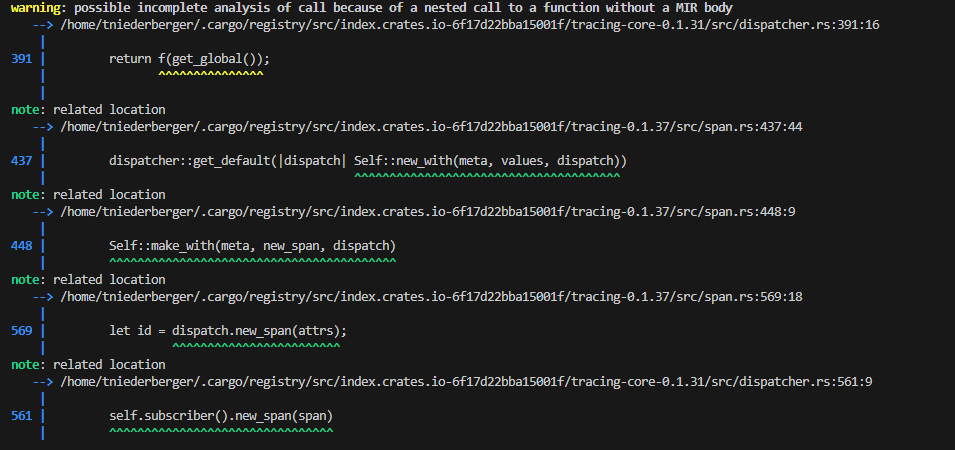

# Proof of Concept: Tag Analysis for validation of unsigned transactions

This is a copy of substrate's example of an [offchain worker](https://github.com/paritytech/substrate/tree/ea9ce4c0af36310c0b0db264ab12cf4766b83750/frame/examples/offchain-worker), enriched with a MIRAI [tag-analysis](https://github.com/facebookexperimental/MIRAI/blob/main/documentation/TagAnalysis.md). It is a first proof-of-concept for [validation of unsigned transactions](https://github.com/bhargavbh/MIRAI/blob/main/substrate_examples/unsigned-transaction/description.md).

# Running

1. Clone this repo with `git clone https://github.com/scs/MIRAI.git`
2. Checkout this branch: `git checkout Milestone1_Research`
3. [Install MIRAI](https://github.com/facebookexperimental/MIRAI/blob/main/documentation/InstallationGuide.md)
4. Run the analysis with `cargo mirai`from within this folder. The [config.toml](.cargo/config.toml) makes sure, that the analysis only runs on the function [`mirai_check.code_to_analyze`](src/mirai.rs).

# Tag Analysis
We use [tag analysis](https://github.com/facebookexperimental/MIRAI/blob/main/documentation/TagAnalysis.md) from MIRAI. In this example, we want to verify that all parameters are properly verified before we call `check_data`. The tags are set in `validate_transaction_parameters` once the parameters pass the validation checks:
``` rust
    let current_block = <system::Pallet<T>>::block_number();
    if &current_block < block_number {
        return InvalidTransaction::Future.into()
    }
    add_tag!(block_number, ParameterVerified);
    
    // Arbitrary check that price is bigger than some value
    if 100 > *new_price {
        return InvalidTransaction::Future.into()
    }
    add_tag!(new_price, ParameterVerified);
```

The `check_data` function is currently not doing anything but it requires that the two parameters have the `ParameterVerified` tag:

``` rust
    #[requires(has_tag!(new_price, ParameterVerified))]
    #[requires(has_tag!(block_number, ParameterVerified))]
    fn check_data(
        block_number: &T::BlockNumber,
        new_price: &u32,
    ) {

    }
```

## Output

When we run ``cargo mirai``, ``check_data`` in line 356

``` rust
let res = Self::validate_transaction_parameters(block_number, new_price);
// uncomment the if-statement to get no warning
//if res.is_ok() {
Self::check_data(block_number, new_price);
//}
```

results in a warning:


When we call `check_data` only if the transaction is valid

``` rust
let res = Self::validate_transaction_parameters(block_number, new_price);
// uncomment the if-statement to get no warning
if res.is_ok() {
    Self::check_data(block_number, new_price);
}
```
the warning is not generated.


## Open issues

> When reproducing the examples, make sure to run `cargo clean` after changing the [.cargo/config.toml](.cargo/config.toml).

- The issues described here occurred on the `devvirtualbox` test machine. Also see [Test machine specifications](../README.md#test-machines)

- One specific piece of code leads (see line 745 in `src/lib.rs`) to a crash in MIRAI. This could not be reproduced on the `devsgx02` test machine.


- For more complex scenarios timeouts arise within MIRAI. 
  - For example with an empty [.cargo/config.toml](.cargo/config.toml) file. See [../pallet_template/README.md](../pallet_template/README.md) for more information regarding this.
  - Increasing the `body_analysis_timeout` parameter lead to MIRAI crashes in some cases.

- There are a variety of other warnings raised from code in other crates. This is confusing for the user. For example:
```
warning: possible incomplete analysis of call because of a nested call to a function without a MIR body
   --> /home/tniederberger/.cargo/registry/src/index.crates.io-6f17d22bba15001f/tracing-core-0.1.31/src/dispatcher.rs:402:29
    |
402 |         .unwrap_or_else(|_| f(&NONE))
    |                             ^^^^^^^^
    |
note: related location
...
```

- There are warnings regarding missing MIR bodys. To see this enable the third line and disable the second in [.cargo/config.toml](.cargo/config.toml):
  ``` toml
  [env]
  #MIRAI_FLAGS = { value = "--diag=paranoid --single_func=pallet_example_offchain_worker.mirai.mirai_check.code_to_analyze"}
  MIRAI_FLAGS = { value = "--diag=paranoid --single_func=pallet_example_offchain_worker.mirai.mirai_check.submit_unsigned_transaction"}
  MIRAI_LOG = { value = "info", force = true }
  ```
  Then warnings like this are generated:
  

- We also tried to do the tag check directly on the `submit_price_unsigned` function as this would be closer to a real world use-case but we did not manage to get this to work correctly. We believe this is related to the timeout and missing MIR body warnings that MIRAI observed (see issues above) but further investigation would be needed to verify this is indeed the problem.

- In the debug log of MIRAI there are multiple log messages regarding a bug:
  ```
  [0u]: &("internal error: entered unreachable code: /!\\ `LevelFilter` representation seems to have changed! /!\\ \nThis is a bug (and it's pretty bad). Please contact the `tracing` maintainers. Thank you and I'm sorry.\n The offending repr was: ")
  ```
  This can be seen by setting the log level in MIRAI to `debug` in the  [.cargo/config.toml](.cargo/config.toml)
  ``` toml
  [env]
  #MIRAI_FLAGS = { value = "--diag=paranoid --single_func=pallet_example_offchain_worker.mirai.mirai_check.code_to_analyze"}
  MIRAI_FLAGS = { value = "--diag=paranoid --single_func=pallet_example_offchain_worker.mirai.mirai_check.submit_unsigned_transaction"}
  MIRAI_LOG = { value = "debug", force = true }
  ```